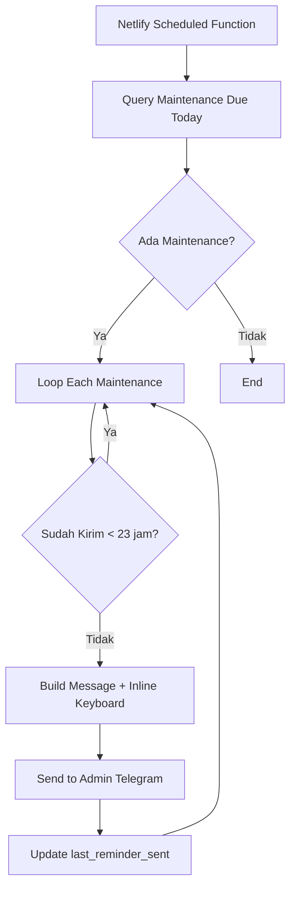

# Design Document: Admin Telegram Notification

## Overview

Fitur ini memperluas sistem reminder yang sudah ada untuk mengirim notifikasi ke admin Telegram dengan tombol inline WhatsApp. Sistem akan menggunakan Telegram Bot API untuk mengirim pesan dengan inline keyboard yang berisi deep link ke WhatsApp klien dengan pesan template yang sudah terisi.

## Architecture



## Components and Interfaces

### 1. Modified Telegram Utility (`netlify/functions/utils/telegram.js`)

Menambahkan fungsi baru untuk mengirim pesan dengan inline keyboard:

```javascript
/**
 * Mengirim pesan Telegram dengan inline keyboard
 * @param {string} message - Pesan dalam format HTML
 * @param {string} chatId - Telegram Chat ID tujuan
 * @param {Array} inlineKeyboard - Array of button rows
 * @returns {Promise<boolean>} - Success status
 */
export async function sendTelegramMessageWithButton(message, chatId, inlineKeyboard)
```

### 2. WhatsApp Deep Link Builder

Fungsi untuk membuat URL WhatsApp dengan pesan pre-filled:

```javascript
/**
 * Membuat WhatsApp deep link dengan pesan template
 * @param {string} phoneNumber - Nomor WA klien (format: 628xxx)
 * @param {string} clientName - Nama klien
 * @param {string} projectName - Nama project
 * @param {number} amount - Nominal tagihan
 * @returns {string} - WhatsApp URL
 */
function buildWhatsAppLink(phoneNumber, clientName, projectName, amount)
```

### 3. Modified Scheduled Reminders (`netlify/functions/scheduled-reminders.js`)

Modifikasi untuk mengirim ke admin dengan inline button:

- Menggunakan Admin Telegram ID dari environment variable `ADMIN_TELEGRAM_ID`
- Menggunakan Bot Token dari environment variable `TELEGRAM_BOT_TOKEN`
- Menambahkan inline keyboard dengan tombol WhatsApp

## Data Models

### Telegram Message with Inline Keyboard

```javascript
{
  chat_id: "<ADMIN_TELEGRAM_ID>",
  text: "<message in HTML format>",
  parse_mode: "HTML",
  reply_markup: {
    inline_keyboard: [
      [
        {
          text: "📱 Kirim Reminder ke WA",
          url: "https://wa.me/628xxx?text=..."
        }
      ]
    ]
  }
}
```

### WhatsApp Deep Link Format

```
https://wa.me/{phoneNumber}?text={encodedMessage}
```

Contoh pesan template:
```
Halo kak {clientName}, ini reminder pembayaran maintenance web {projectName} senilai Rp {amount}. Mohon diselesaikan ya. Pembayaran bisa lewat e-wallet atau rekening. Terima kasih 🙏
```


## Correctness Properties

*A property is a characteristic or behavior that should hold true across all valid executions of a system-essentially, a formal statement about what the system should do. Properties serve as the bridge between human-readable specifications and machine-verifiable correctness guarantees.*

### Property 1: Only Due Maintenance Gets Notified

*For any* set of maintenance records with various payment_date values, when the scheduled function runs, only maintenance records where payment_date equals today's date should trigger notifications.

**Validates: Requirements 1.1**

### Property 2: Message Contains All Required Information

*For any* maintenance record with client name, project name, amount, and WhatsApp number, the generated notification message should contain all four pieces of information formatted correctly (amount in Indonesian Rupiah format with "Rp" prefix and thousand separators).

**Validates: Requirements 1.2, 4.1, 4.2, 4.3**

### Property 3: WhatsApp Button Contains Valid URL and Template

*For any* valid phone number, client name, project name, and amount, the generated WhatsApp deep link should:
- Start with "https://wa.me/"
- Contain the phone number (without + prefix)
- Contain URL-encoded message with client name, project name, and amount

**Validates: Requirements 1.3, 2.2**

### Property 4: Duplicate Prevention Within 23 Hours

*For any* maintenance record, if last_reminder_sent is within 23 hours of current time, the system should skip sending notification. If last_reminder_sent is null or older than 23 hours, the system should send notification.

**Validates: Requirements 3.1, 3.3**

## Error Handling

| Scenario | Handling |
|----------|----------|
| Telegram API failure | Log error, continue to next maintenance, return partial success |
| Invalid phone number | Send notification without WhatsApp button |
| Database query failure | Log error, return 500 status |
| Missing environment variables | Log error, skip notification |

## Testing Strategy

### Property-Based Testing Library

Menggunakan **fast-check** untuk JavaScript property-based testing.

### Unit Tests

1. **WhatsApp Link Builder**
   - Test dengan berbagai format nomor telepon
   - Test encoding karakter khusus dalam pesan

2. **Message Formatter**
   - Test format currency Indonesia
   - Test struktur pesan dengan emoji

3. **Duplicate Check Logic**
   - Test dengan timestamp null
   - Test dengan timestamp < 23 jam
   - Test dengan timestamp > 23 jam

### Property-Based Tests

Setiap property-based test harus:
- Menjalankan minimal 100 iterasi
- Di-tag dengan format: `**Feature: admin-telegram-notification, Property {number}: {property_text}**`
- Menggunakan fast-check library

### Integration Tests (Optional)

- Test end-to-end dengan mock Telegram API
- Test database update setelah notifikasi terkirim

